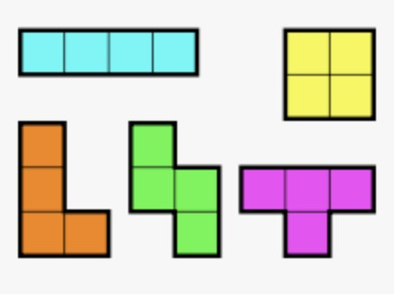

fillit
======

Goals of the project
--------------------

Fillit is one of the projects at 42 curcus. The main goal is to fill the square with **Tetraminos** - pieces from 
[Tetris](https://en.wikipedia.org/wiki/Tetris) game. (Check picture below). This square must be as small as possible.

Algorithm
---------
